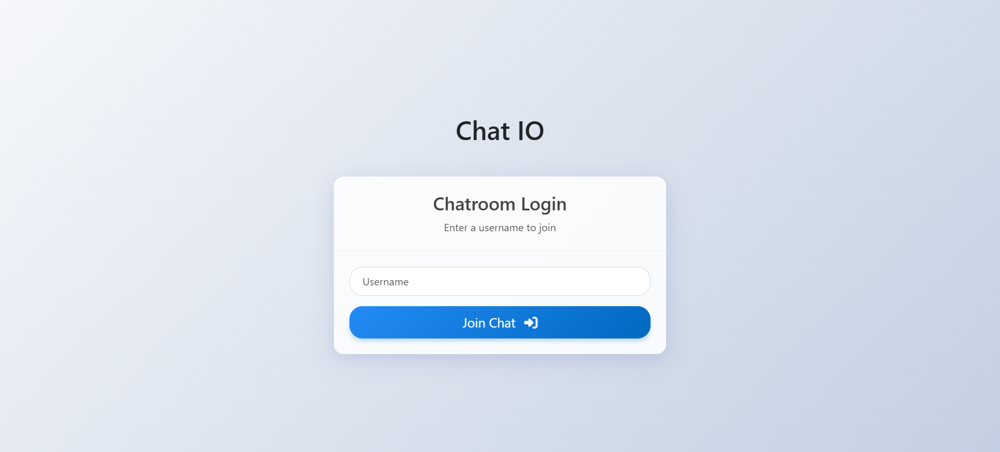
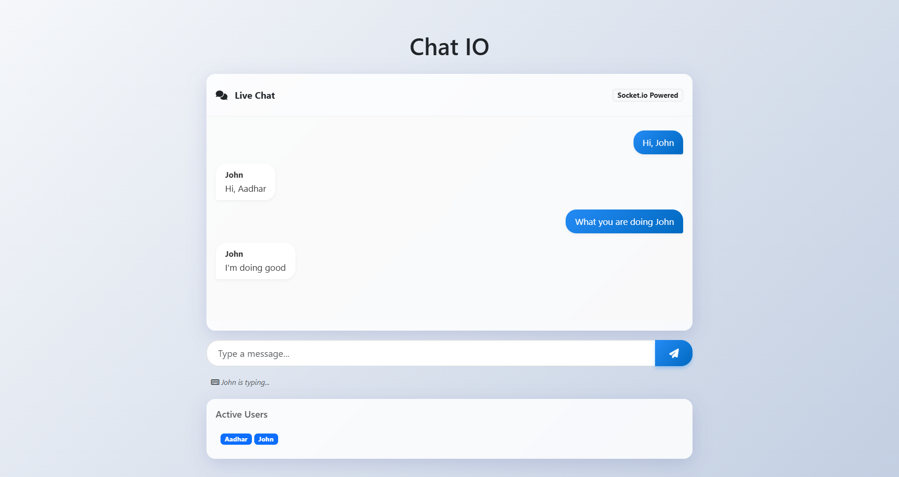

# **💬 ChatIO - Real-Time Chat Application**


**A modern, real-time chat application built with Node.js, Socket.io, and Bootstrap 5.**

---

## **✨ Features**

*   **Real-time Messaging**: Instant message exchange using Socket.io
*   **Modern UI**: Glassmorphism design with responsive Bootstrap 5 layout
*   **User Management**: unique username creation with validation
*   **Active Users List**: See who's currently online
*   **Typing Indicators**: Visual feedback when others are typing
*   **Message Bubbles**: Distinct styles for sent vs. received messages
*   **Validation**: Client-side protection against empty messages and username constraints
*   **Responsive**: Works seamlessly on desktop and mobile
*   **Separation of Concerns**: Clean project structure with separated CSS/JS

---

## **🛠️ Tech Stack**

**Frontend:**
*   HTML5 & Semantic Structure
*   CSS3 (Custom styles + Bootstrap 5)
*   jQuery (DOM manipulation)
*   Socket.io Client

**Backend:**
*   Node.js
*   Express.js
*   Socket.io Server

---

## **📸 Screenshots**

### **Home Page**


### **Chat Room**


---

## **📦 Installation**

### **Prerequisites**
*   [Node.js](https://nodejs.org/) (v14+)
*   [npm](https://www.npmjs.com/)

### **Quick Start**

1.  **Clone the repository:**
    ```bash
    git clone https://github.com/aadhar41/chat-app.git
    cd chat-app
    ```

2.  **Install dependencies:**
    ```bash
    npm install
    ```

3.  **Start the server:**
    ```bash
    npm start
    # or
    node server.js
    ```

4.  **Open in browser:**
    Visit `http://localhost:3001`

---

## **📁 Project Structure**

```
chat-app/
├── public/
│   ├── css/
│   │   └── style.css       # Modern custom styles
│   ├── js/
│   │   └── chat.js         # Client-side chat logic
│   └── images/             # Application screenshots
├── index.html              # Main application entry
├── server.js               # Express & Socket.io server
├── package.json            # Dependencies
└── README.md               # Documentation
```

---

## **🤝 Contributing**

Contributions are welcome! Please feel free to submit a Pull Request.

1.  Fork the project
2.  Create your feature branch (`git checkout -b feature/AmazingFeature`)
3.  Commit your changes (`git commit -m 'Add some AmazingFeature'`)
4.  Push to the branch (`git push origin feature/AmazingFeature`)
5.  Open a Pull Request

---

## **📝 License**

This project is licensed under the ISC License.
